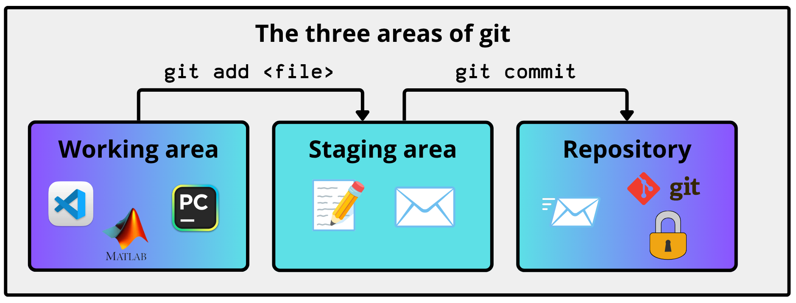

# 🏯 **<span style="text-decoration: double underline; color:rgba(10,130, 250)">Chapter 1: The Repository and the Commit</span>**

**Author:** Ángel F. Caravaca   
**Date:** 20/07/2026

---

In the previous chapter we configured and identity and a signature, both described as something that Git stamps onto your commits. However, we never explained what a commit actually is. Now that we have the credentials to "speak" with GitHub, and an identity that will be associated to you, let's move on to where the work lives, i.e., what Git records, and where it keeps it.

## 🗄️ **<span style='color:rgba(10,130,250)'><u> What is a repository? </u></span>**

A repository is just a directory in your tree that storages the special folder `.git`. There is nothing else to it. If that folder is present, the directory is a repository, whereas if you delete it, the directory instantly becomes an ordinary folder again, with your files untouched but their entire history gone.

>[!NOTE]
We are referring here to a local repository: one that lives only on your machine and has not yet been connected to GitHub (its **remote** counterpart). Keep this distinction in mind, since for now everything happens locally, with no other party involved.

To create the **local** repository, you do it with a single command, executed from inside the directory you want to track:

```sh
cd my-project
git init
```

After this, Git replies with something like `Initialized empty Git repository in <path>/.git/`. From this moment, every command you run inside that directory or any of its subdirectories is related to this `.git` folder (repository).

Now, One point worth stressing is *how Git knows it is inside a repository*, and more importantly, *which one*. Well, Git locates the repository by walking *upwards* from the current directory until it finds the first `.git` folder. Once found, the changes are instantly related to this repository.

>[!WARNING]
This is precisely why you shouldn't create a repository inside another: Git will treat the nested .git folder as ordinary content (or silently ignore it), leading to confusing, unpredictable behavior about which repository actually owns your files.


## 🗂️ **<span style='color:rgba(10,130,250)'><u> The .git folder </u></span>**

Now, let us look inside the `.git` folder that was just created. Just run:

```sh
ls -a .git
```

Some of the folders and files you'll find here are:


- **`objects/`:** this is the database of the repository, and the most important folder in it. Every commit, every directory listing and every file content you create is stored here as an immutable object. This is where your history physically lives.

  There are three types of objects in this folder:

  - A **blob** is the raw content of a file — just the bytes, exactly as they sit on disk, in their rawest form. It doesn't even know its own filename.
  - A **tree** is a directory listing: it maps names to hashes, so it's the tree that knows a certain blob is called `README.md` (think of it as the output of `ls` for a single folder — one level only). A subfolder isn't stored as a path, but as the hash of *another* tree, so the full repository architecture is rebuilt by nesting trees, one level inside the next.
  - A **commit** points to one top-level tree (the root of the snapshot) plus its parent and metadata (author, date, message). It holds no files and no list of changes itself, as the whole snapshot lives in that tree, and the "modified files" you see in `git show` are a diff Git computes on the fly by comparing two snapshots.

  Therefore a commit is a full snapshot because it points to a tree, and that tree reaches every blob in the project at that instant. This also explains deduplication: a file that doesn't change between two commits is the same content, so it's the same blob, stored only once.

  One last thing before moving on. If you open `.git/objects` you won't find files literally named `blob`, `tree` or `commit`. Git names every object by its 40-character hash, split into a 2-character folder and a 38-character filename (so the hash `5c1b14…` lives at `.git/objects/5c/1b14…`). Each of those files *is* one blob, tree or commit — just compressed, which is why you inspect them with `git cat-file` instead of opening them by hand. If you're curious, you can peek inside any object:

    ```sh
    git cat-file -t <folder><file>   # type: blob / tree / commit
    git cat-file -p <folder><file>   # pretty-print of the content
    git cat-file -s <folder><file>   # size in bytes
    ```
  <span style='color:rgba(210,110,50)'> **For example:** </span> for the object stored at `.git/objects/5c/1b14…`, the hash is `5c` + `1b14…`, so you run `git cat-file -t 5c1b14…`.

>[!NOTE]
When you commit with `git commit -m "<message>"`, Git immediately replies with a line like `[<branch> <short-hash>] <message>`. For instance, `[main a3f9c21] Add objects section`. That `<short-hash>` is the first 7 characters of the new commit's full hash, and you can use it to refer to the commit in later commands (`git show a3f9c21`, `git reset a3f9c21`, and so on).

- **`refs/`:** this folder contains text files with human-readable names. Each of these holds a commit hash, i.e., a unique code that identifies a commit.  
  
    <span style='color:rgba(210,110,50)'> **For example:** </span> the typical case is a branch file, such as `refs/heads/main`, whose content is the hash of the most recent commit on that branch. That hash is the identifier of a commit living in `objects/`. Notice that the ref doesn't hold the commit itself (what you did), only the pointer to it. Moreover, when you make a new commit, Git rewrites the file so it points to the new commit, and the branch moves forward on its own.  
    It works like the contacts app on your phone: the entry "Mom" (the file) holds a phone number (the hash), nothing more. If your "Mom" changes her number, you must rewrite it — that rewrite is what a new commit does to the branch.
 
    Branches aren't the only kind of ref, though. The folder is organised into three subfolders (these are examples):

| File in `refs/` | Contains | What the name means | What updates it |
| --- | --- | --- | --- |
| `heads/main` | a commit hash | the latest commit on your local `main` | `git commit` |
| `remotes/origin/main` | a commit hash | where `main` was on the remote last time you fetched | `git fetch` / `git pull` |
| `tags/v1.0` | a commit hash | the commit you marked as version 1.0 | `git tag v1.0` (created, never updated) | 

>[!IMPORTANT]
A tag like `v1.0` is a name you pin by hand to one specific commit to mark it as meaningful — almost always a released version. Unlike `main`, which Git created for you at your first commit, a tag exists only because you explicitly ran `git tag v1.0` on the commit you wanted to immortalise. And unlike a branch, a tag never moves: it stays nailed to that exact commit forever, so you can always return to precisely what you shipped. 

- **`HEAD`:** a file that tells Git which branch you're on right now.

- **`index`:** this is the staging area, stored as a single binary file. When you run `git add`, Git doesn't just flag the file as "ready", it records the file's content at that instant into the index. So the index isn't just a list of names, but a draft of your next commit. 

>[!Important]
Editing a file *after* staging it leaves the staged version behind: the index holds the frozen content, not a live link to the file on disk. Moreover, there's one index for the whole repository, which is also why switching branches rewrites it.

- **`config`:** the repository-local configuration. "Local" here means it applies only to *this* repo and overrides your global settings in `~/.gitconfig`, the ones you set with `git config --global` back in Chapter 0. <span style='color:rgba(210,110,50)'> **For example:** </span> you could override the identity used for this repo by running `git config user.email ...` without the `--global` flag. It holds things like the URL of the remote this repo is linked to, any local identities, etc. Unlike `objects/` or `index`, this is a plain text file you can safely read and edit by hand.

>[!NOTE]
The `~/.gitconfig` file is the global configuration of Git on your machine, that is, the "defaults" applied to every repository you create. For instance, this is where you set `init.defaultBranch` to decide what your initial branch is called:. For example, my default is called `main` but you could call it `root`.  Normally you edit this global config by running a specific command in the terminal rather than opening the file by hand.

- **`info/exclude`:** works exactly like `.gitignore`, but privately: it lives only in your `.git` folder, so it is never shared with anyone who clones the repository. We will cover `.gitignore` itself later in this course; think of this file as its local-only sibling.

    Here you could ask yourself *if this works exactly like `.gitignore`, why would I use both?* The reason is not what they do, but who sees them:

    - `.gitignore`: a versioned, shared file that you commit into the repo, so everyone who clones it gets the same ignore rules. Use it for things the *whole project* must ignore, like `node_modules/` or `build/`.
    - `info/exclude`: lives inside `.git` and is never shared, so it's a private `.gitignore` that only *you* see. Use it for things only *you* need to ignore, such as the editor or IDE junk or a personal scratch file without cluttering the shared `.gitignore` with rules that concern nobody but you. It's also the right tool when contributing to someone else's project, where editing their `.gitignore` would show up as an unwanted change in your contribution.

    There's a subtler angle I believe is worth noting. A `.gitignore` rule is itself shared, so the moment you write `secrets.txt` in it, you never upload that file, but you *do* announce to everyone that such a file exists on your machine, since the rule travels with the repo for all to read. Putting the rule in `info/exclude` keeps the rule private too, not just the file, as you ignore it without leaving any trace that it was ever there. 

>[!WARNING]
Please do not take the previous paragraph as a security rule. The `info/exclude` stops you from *advertising* a file's existence in a shared rule, but it does nothing to protect the file itself!

- **`hooks/`:** scripts that Git can run automatically at specific points in your workflow, such as right before a commit or right before a push. The folder ships empty (with `.sample` examples), but this is exactly where tools like linters or formatters plug themselves in. <span style='color:rgba(210,110,50)'> **For example,** </span> you may find the `hooks/commit-msg.sample`, which is executed after every `git commit`.

- **`logs/`:** keeps the *reflog*, a private record of everywhere `HEAD` has moved on your machine. Remember that `HEAD` shifts with almost everything you do. Every commit, branch switch, or `reset` moves it, and this file writes down each of those jumps. It's not the project history, it's your local trail of "where I've been", and it never leaves your machine. That trail is a safety net: even after a `reset` that seems to erase a commit, this reflog still remembers `HEAD` was there a moment ago, which is how you get it back. More on this later in this course.

- **`ORIG_HEAD`:** a companion to the reflog. Before certain operations that can rewrite history quite drastically (`reset`, `merge`, `rebase`), Git saves your previous position here, so that `git reset --hard ORIG_HEAD` gives you a one-step way back if the operation goes wrong.

The rest (`branches/`, `description`, `COMMIT_EDITMSG`, `FETCH_HEAD`, `packed-refs`, etc.) is machinery that Git manages on its own. Some of them, like `branches/`, are leftover from older workflows nobody uses now. Unlike the files above, there is no point in this course where you will need to open or reason about them; they appear and update automatically based on the operations you execute.

## 🚥 **<span style='color:rgba(10,130,250)'><u> The three areas of git </u></span>**

Now that we know what a repository is, the next natural question is *how a change travels from the editor to the history*. Git does not take you from one to the other in a single step, as it adds an intermediate area between them, so your files pass through three areas in total before a change is recorded. Understanding why this middle area exists is worth the effort, since it shapes how you compose every commit from here on.

The three areas of git are:

1. **The *working* area:** your project directory as it exists on disk or, to keep it simple, what your editor opens and saves. This is the only area you manipulate directly, as this is the place where you write, break and fix your code. Right now, as I write this file, its latest content exists only in the working area.
   
2. **The *staging* area (or *index*):** the draft of your next commit. When you mark a change as ready with `git add <file>`, Git copies the file's content *as it stands at that instant* into this area and holds it there. Nothing is permanent yet, since you can add to it, remove from it or rebuild it as many times as you want, until the draft matches exactly what you intend to record.
   
3. **The *repository* (history):** the sequence of commits stored inside `.git/objects`. Content lands here when you run `git commit`, and once it does it is permanent, immutable and safe to share. 

>[!Important]
Any work living in the working or staging area can be lost for good. However, once it reaches the repository, it can be recovered. Keep this in mind before applying any drastic change to your files.

The reason this *staging* area exists is that **what you have changed and what you want to record are rarely the same thing**. During a single session you often touch many unrelated things, as you may fix a bug, correct a few typos in the documentation, and leave a new function half-written in a third file. Committing all of that at once produces a commit that cannot be described in one sentence, and therefore cannot be understood, reviewed or reverted as a unit.

The staging area is what lets you avoid that. Instead of recording everything you happened to change, you compose each commit deliberately: first, you stage the bug fix alone and commit it, then stage the documentation and commit that separately, all while the unfinished debugging code stays untouched in your working directory. The result is a history that reflects the logic of the project rather than the chronology of your afternoon, yielding something easy to read, and easy to revert one change without dragging the others along.

To summarise this section, the following diagram shows how these three areas connect and how your content moves through them:

<div align='center'>

</div>

>[!Warning]
Everything described in this section happens entirely on your local machine. The remote side, i.e., GitHub and the `push` that sends your commits there,has not been introduced yet, and belongs to a later chapter.

## 💊 **<span style='color:rgba(10,130,250)'><u> Read the status of your repo </u></span>**

Since files silently move between these areas, you need a way to ask Git where everything currently stands. That is git status, and it is the command you will run more often than any other:

```sh
git status
```
In a repository with pending work, the output looks roughly like this:

```sh
On branch main # branch you are currently on

Your branch is up to date with 'origin/main'. # how you stand vs the remote 

Changes to be committed: # STAGING AREA: staged with 'git add', to be commited
  (use "git restore --staged <file>..." to unstage)
        modified:   Chapter01.md

Changes not staged for commit: # the WORKING AREA: modified but not yet staged
  (use "git add <file>..." to update what will be committed)
  (use "git restore <file>..." to discard changes in working directory)
        modified:   README.md

Untracked files: # files Git has never seen, not in the history, never staged
  (use "git add <file>..." to include in what will be committed)
        images/three-areas.png
```

Read it as a direct map of the three areas described above:

- **Changes to be committed** is the staging area. Everything listed here will be part of your next commit, and nothing else will.

- **Changes not staged for commit** is the working directory. Git already knows about these files, since they exist in the history, but the modifications you have just made have not been marked as ready.

- **Untracked files** are files Git has never seen before. Basically, they are new files. They are in your directory but not under version control at all, and Git will keep ignoring them until you git add them for the first time.

>[!Note]
Notice as well that the output is not merely descriptive but instructional, as **each section tells you the command that undoes or advances it**. This is worth exploiting rather than memorising commands blindly.

>[!TIP]
Running `git status` before every `add` and every `commit` costs nothing and tells you exactly where your repository stands: which files are staged, which are only modified, and which are still untracked. This habit prevents from committing a file you did not mean to include, or missing one you did.

For a compact view once you are comfortable with the concepts:
```sh
git status -s       # short format
```
Personally, I find this view useful only once you are comfortable with the long format, so I will just summarise it here:

The short format uses two columns: the **left** column is the staging area, the **right** column is the working directory. The same letter means the same kind of change in either position — what changes is *where* it appears.

| Output | Left (staging) | Right (working) | Meaning |
| --- | --- | --- | --- |
| `M ` | `M` | — | modified and **staged** |
| ` M` | — | `M` | modified, **not staged** |
| `MM` | `M` | `M` | staged, then modified again — the two versions differ |
| `A ` | `A` | — | new file **staged** for the first time |
| `AM` | `A` | `M` | staged as new, then modified again |
| `D ` | `D` | — | deletion **staged** |
| ` D` | — | `D` | deleted in the working directory, not staged |
| `R ` | `R` | — | renamed, staged |
| `C ` | `C` | — | copied, staged |
| `??` | `?` | `?` | untracked — Git has never seen this file |
| `UU` | `U` | `U` | merge conflict — both sides changed it |

>[!NOTE]
VSCode shows similar single-letter markers next to each filename in the explorer (`M`, `U`, `A`…), and colours them by state. It is the same idea, though it does not use the two-column layout.

