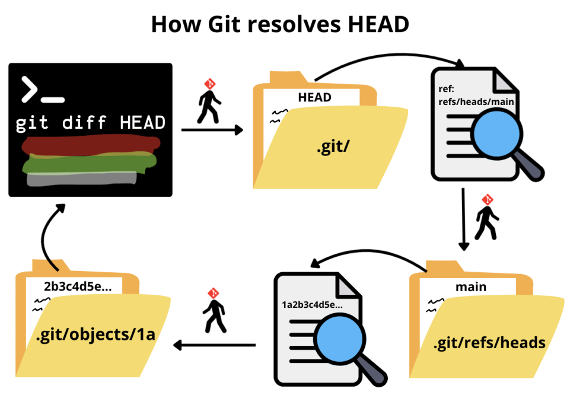

# 🚢 **<span style="text-decoration: double underline; color:rgba(10,130, 250)">Chapter 2: Navigating History and Undoing Changes</span>**

**Author:** Ángel F. Caravaca   
**Date:** 21/07/2026

---

In the previous chapter we established what a commit is and how it moves through the three areas of Git. That gave us a way to *record* history, but not yet a way to *read* it or *undo* it. Right now every commit you have made lives inside `.git/objects`, yet we have no way to inspect it. In this chapter we will learn how to trace what we did, compare two moments in time, and undo a change without losing our work.

## 📜 **<span style='color:rgba(10,130,250)'><u> Reading the history </u></span>**

The most direct way to trace what you did in the repository is `git log`, which lists commits from the most recent to the oldest, walking backwards through the parent chain we described in Chapter 1. The command is:

```sh
git log
```
Git will instantly reply with a list of blocks like this one:

```bash
commit <hash - identifier>
Author: user.name <user.email>
Date:   full date

    commit message
```
The default view of this command, although useful, is quite simple, and it only displays the metadata of the commits. You can get more information using flags. These flags don't change what `git log` does, they only change how much of each commit is shown and how it is formatted. Some examples are:

```sh
git log --oneline           # one line per commit: short hash + subject
git log --oneline --graph   # adds a text graph of branches and merges
git log -p                  # shows the full diff introduced by each commit
git log --stat              # shows only which files changed, and by how much
```

>[!NOTE]
> VSCode offers extensions (such as Git Graph or GitLens) that display this same
> information graphically, instead of as text in the terminal. <span style='color:rgba(210,110,50)'> **For example:** </span>, the
> commit graph you get from `git log --oneline --graph` is shown visually in the
> *Graph* view of the Source Control panel. A later chapter is dedicated to these
> extensions, but it is worth knowing that these commands exist before moving on
> to the prettier versions built on top of them.

Beyond controlling the format and how much of each commit is shown, you can also narrow the history down to the commits you care about, instead of scrolling through all of it. Some flags that come in handy are:

```sh
git log -n 5                     # only the last 5 commits
git log --author="Ángel"         # commits by a specific author
git log --since="2 weeks ago"    # commits after a given date
git log -- <file>                # commits that touched this file only
git log --grep="fix"             # commits whose message matches this string
```

>[!TIP]
> When you run `git log` or `git diff`, keep in mind that:
> - Press `q` to exit.
> - Press `Space` to move one page.
> - Press `b` to return one page.
> - `↑` / `↓` to advance one line.
> - `g` / `G` to go to the beginning or the end.
> - `/text` to search a specific word or text. In this option, press `n` / `N` to move to the next or the previous match. (`/New function`)

## 🕵 **<span style='color:rgba(10,130,250)'><u> Comparing two states </u></span>**

Where `git log` tells you *what you did*, `git diff` tells you *what you changed*, expressed as additions and deletions of lines. 

To understand how to use this command, recall the three areas from Chapter 1: working directory, staging area, and repository. The command `git diff` always compares two of them, and which two depends on the flags you give it:

| Command | Compares | Intuition |
| --- | --- | --- |
| `git diff` | Working area vs staging area | What you have edited but not staged yet |
| `git diff --staged` | Staging area vs `HEAD` | What you are about to commit, compared to your last commit in the current branch  |
| `git diff HEAD` | Working area vs `HEAD` | Everything you have changed since your last commit in the current branch, staged or not |

>[!IMPORTANT]
This is the one of the most common source of confusion for beginners: plain `git diff` does **not** show you what has changed since your last commit, it shows you what is *unstaged*. If you have already staged everything with `git add`, plain `git diff` prints nothing, even though your working directory clearly differs from the last.

Three things to keep in mind while running this command under any of its variants:

- **File header:** each file in the diff opens with the two versions being compared. Both paths are usually identical, since it is the same file at two moments in time.

```diff
--- a/File   # the old version
+++ b/File   # the new version
```
- **Line prefixes:** every line carries a one-character prefix telling you what happened to it. They are also colored to ease the comprehension. Moreover, note that there is no prefix for *modified*, since editing a line is recorded as a removal followed by an addition.
```diff
+> this line was added
-> this line was removed
>   this line is unchanged context, shown only to orient you
```

- **Block header:** each block of changes starts with a line such as `@@ -7,3 +7,4 @@`. Read it as coordinates: the block covers 3 lines starting at line 7 of the old version, and 4 lines starting at line 7 of the new one.

Once you are comfortable using `git diff` to compare your current work, it is worth knowing that the command is far more powerful than that. Any two points in the history can be compared, not just the three areas: two arbitrary commits, a commit against your working directory, or the tips of two branches.

```sh
git diff <hash1> <hash2>       # between two specific commits
git diff HEAD~2 HEAD           # between two commits ago and now (see HEAD~n below)
git diff <branch1> <branch2>   # between the last commits of two branches
```

To find the hashes you need here, run `git log`, as it is the command that tells you *what you did*, and the short hash printed by `git log --oneline` is enough to identify a commit.


## 🫆 **<span style='color:rgba(10,130,250)'><u> Inspecting a single commit </u></span>**

While `git diff` compares two points, `git show` looks at a single one. It prints the metadata of a commit followed by the diff it introduced against its parent, so it behaves like a "combination" of `git log` and `git diff`. It also accepts the formatting flags of both:

```sh
git show                  # the commit HEAD points to, i.e. your last one
git show <hash>           # a specific commit: metadata + the diff it introduced
git show <hash> --stat    # the same, but only which files changed and by how much
```

In particular, I would like to mention a second use of this command, which is where it becomes genuinely handy. You can ask for the content of a single file *as it existed in that commit*:

```sh
git show <hash>:path/to/file   # the file as it was in that commit
git show HEAD::path/to/file    # the file as it was in your last commit
```

<span style='color:rgba(210,110,50)'> **For example:** </span> if you want to check what `README.md` looked like ten commits ago, you do not need to move anywhere: `git show HEAD~10:README.md` prints it straight to the terminal, leaving your working directory exactly as it is.


## 📌 **<span style='color:rgba(10,130,250)'><u> HEAD: your position in the history </u></span>**

In Chapter 1, we introduced `HEAD` as a file that tells Git which branch you are on. It is worth expanding on that definition now, because it has already appeared in previous commands, and the ones that follow are defined entirely in terms of it.

Actually, `HEAD` is a pointer to a branch that points to the last commit in that branch. You could say *a pointer to a pointer*. In short, `HEAD` contains a path to a file in `refs/heads/`, which is your current *branch*. Inside that branch file there is a hash that is related to a file in `objects/`, i.e. the last commit in that branch.

Understanding this is quite useful, as it gives you an intuition of how the previous commands work. The image below shows how Git resolves `HEAD` when you invoke it in the `git diff HEAD` command.

<div align='center'>

</div>

As mentioned earlier, you can also control how far back you go from `HEAD`, i.e., how many commits you want to travel back in time:
<div align='center'>

| Reference | Means |
| --- | --- |
| `HEAD` | the current commit |
| `HEAD~1` (or `HEAD^`) | the parent of the current commit |
| `HEAD~2` | the grandparent — two steps back |
| `HEAD~n` | *n* steps back, following the first parent each time |
</div>
